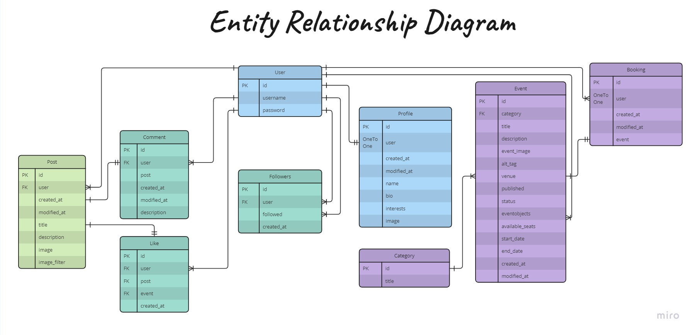

# Little Angels
Little Angles is designed to be a social platform for the parents to get together and collaborate with each others. The primary goals of the web are to:
1. Provide parents the ability to share the picture of their little ones with others and make it an unforgetable memory for themselves;
2. Act as an hub for parents to get informed about the events and social activities and book one.
3. Provide a simple and inituitive user experience for parents to use.
4. Offers a minimal set of impactful features chosen in order to deliver a useful app within achieveable development timeframe, while laying a solid foundation for additional features in the future.

The site is showcasing Python (DRF framework), JavaScript (React library), HTML, CSS, Bootstrap, PostgreSQL database, Herokuapp, and Gitpod for Project Portfolio 5.

And can be accessed by this [link.](https://drf-api-littleangels-f86db13e3ae5.herokuapp.com/)

## Contents

- [UX](#ux)
  - [Strategy](#strategy)
    - [User Stories](#user-stories)
  - [Scope](#scope)
    - [Simple and intuitive User Experience](#simple-and-intuitive-user-experience)
    - [Relevant content](#relevant-content)
    - [Features for upgraded experience](#features-for-upgraded-experience)
    - [Different account types for Participants and staff members / Admin](#different-account-types-for-participants-and-staff-members--admin)
    - [Responsiveness](#responsiveness)
  - [Structure](#structure)
  - [Skeleton](#structure)
    - [Wireframes](#wireframes)
    - [Database](#database)
  - [Surface(Design)](#surface-design)
    - [Color Scheme](#color-scheme)
    - [Imagery](#imagery)
    - [Typography](#typography)
- [Agile Methodology](#agile-methodology)
- [Features](#features)
  - [Existing Features](#existing-features)
  - [Features Left to Implement](#features-left-to-implement)
- [Technologies Used](#technologies-used)
  - [Languages Used](#languages-used)
  - [Python Packages](#python-packages)
  - [JavaScript Packages](#javascript-packages)
  - [Programs Used](#programs-used)
- [Testing](#testing)
  - [Google Chrome Lighthouse](#google-chrome-lighthouse)
  - [Validator Testing](#validator-testing)
    - [Python Validator - PEP8](#python-validator-pep8)
    - [HTML W3C Validator](#html-w3c-validator)
    - [CSS Jigsaw Validator](#css-jigsaw-validator)
    - [Jshint Validator](#jshint-validator)
  - [Manual Testing](#manual-testing)
    - [Frontend](#frontend)
    - [Backend / Admin Panel](#backend--admin-panel)
  - [Testing User Stories](#testing-user-stories)
     - [User Goals](#user-goals)
     - [Site Administrator Goals](#site-administrator-goals)
  - [Bugs / Issues](#bugs--issues)
  - [Unresolved Bugs / Issues](#unresolved-bugs-or-issues)
- [Deployment](#deployment)
  - [Deploying to Heroku](#deploying-to-heroku)
  - [Fork the repository](#fork-the-repository)
  - [Making a Local Clone](#making-a-local-clone)
- [Credits](#credits)
  - [Content](#content)
  - [Media](#media)
  - [Code](#code)
- [Acknowledgements](#Acknowledgements)

## UX
### Strategy
The objective of the site is to provide a social platform for all users especially parents to register an account, post pictures of the thier litte ones, express their feelings and thoughts through like/unlike a post or leave comment on a post, get informed about events and other social activities and book an event, and follow other users.

#### User Stories
- **User Goals**: 
  *Navigation & Authentication*
    - Navigation: As a user I can view a navbar from every page so that I can navigate easily between pages
    - Routing: As a user I can navigate through pages quickly so that I can view content seamlessly without page refresh
    - Authentication - Sign up: As a user I can create a new account so that I can access all the features for signed up users
    - Authentication - Sign in: As a user I can sign in to the app so that I can access functionality for logged in users
    - Authentication - Logged in Status: As a user I can tell if I am logged in or not so that I can log in if I need to
    - Authentication - Refreshing access tokens: As a user I can maintain my logged-in status until I choose to log out so that my user experience is not compromised
    - Navigation: Conditional rendering - As a logged out user I can see sign in and sign up options so that I can sign in/sign up
    - Avatar: As a user I can view user's avatars so that I can easily identify users of the application

  *Adding & Liking Posts*
    - Create posts: As a logged in user I can create posts so that I can share my images with the world!
    - View a post: As a user I can view the details of a single post so that I can learn more about it
    - Like a post: As a logged in user I can like a post so that I can show my support for the posts that interest me

  *The Posts Page*
    - View most recent posts: As a user I can view all the most recent posts, ordered by most recently created first so that I am up to date with the newest content
    - As a user, I can search for posts with keywords, so that I can find the posts and user profiles I am most interested in.
    - View liked posts: As a logged in user I can view the posts I liked so that I can find the posts I enjoy the most
    - View posts of followed users: As a logged in user I can view content filtered by users I follow so that I can keep up to date with what they are posting about
    - Infinite scroll: As a user I can keep scrolling through the images on the site, that are loaded for me automatically so that I don't have to click on "next page" etc

  *The Post Page*
    - Post page: As a user I can view the posts page so that I can read the comments about the post
    - Edit post: As a post owner I can edit my post title and description so that I can make corrections or update my post after it was created
    - Create a comment: As a logged in user I can add comments to a post so that I can share my thoughts about the post
    - Comment date: As a user I can see how long ago a comment was made so that I know how old a comment is
    - View comments: As a user I can read comments on posts so that I can read what other users think about the posts
    - Delete comments: As an owner of a comment I can delete my comment so that I can control removal of my comment from the application
    - Edit a comment: As an owner of a comment I can edit my comment so that I can fix or update my existing comment

  *Adding Events*
    - View an event: As a user, I can view the details of a single event so that I can learn more about it

  *The Events Page*
    - View published events: As a user, I can view all the most recent events, ordered by most recently published so that I am up to date with the newest content
    - Infinite scroll: As a user, I can keep scrolling through the images on the site, that are loaded for me automatically so that I don't have to click on "next page" etc

  *The Event Page*
    - Event page: As a user I can view the event page so that I can take more actions
    - Book an event: As a logged in user I can book an event so that I can reserve a seat for my little one
    - View bookings: As a user I can view my total bookings that I have
    - Delete bookings: As an owner of a booking I can delete my booking so that I can control removal of my booking from the application

  *The Profile Page**
    - Profile page: As a user I can view other users profiles so that I can see their posts and learn more about them
    - Most followed profiles: As a user I can see a list of the most followed profiles so that I can see which profiles are popular
    - User profile - user stats: As a user I can view statistics about a specific user: bio, number of posts, follows and users followed so that I can learn more about them
    - Follow/Unfollow a user: As a logged in user I can follow and unfollow other users so that I can see and remove posts by specific users in my posts feed
    - View all posts by a specific user: As a user, I can view all the posts by a specific user so that I can catch up on their latest posts, or decide I want to follow them
    - Edit profile: As a logged-in user I can edit my profile so that I can change my profile picture and bio
    - Update username and password: As a logged-in user I can update my username and password so that I can change my display name and keep my profile secure
 

- **Site Administrator Goals**:
  *Event Category*
    - Create, READ, Update, Delete Category: As as Site Admin I can perform CRUD operation on event category so that I can manage the event category content.

  *Events*
  - Create, READ, Update, Delete Event: As a Site Admin I can perform CRUD operation on events so that I can manage the event content.
  - As a Site Admin I can create draft events so that I can finish writing the content later.

  *Handle Errors and Secure Sensitive Information*
  - To handle any potential errors appropriately and consistently.
  - To keep security-sensitive information hidden.

### Scope
#### Simple and intuitive User Experience
 - Ensure the site title and logo provide first-hand information regarding the site;
 - Ensure the navigation menu is visible and functional at every step;
 - Ensure every page has a suggestive name/ icon that fits its content;
 - Ensure the design matches the theme of the event and does not confuse the user.

 #### Relevant content
 - Add information about the post such as user, title, description, image and image_filter, created_at, modified_at;
 - Add information about the event such as category, title, description, event_image, alt_tag, venue, published, status, eventobjects, start_date, end_date, created_at, modified_at;
 - Create relevant navigation buttons for each section;
 - Create a section for like/unlike, comments, booking, and profiles.

 #### Features for upgraded experience
- Create a scrolled list of posts and events that allows the user to view all posts and events along with all their details;
- Create a post detail page that allows users to update and delete the post, like/unlike the post, leave, edit, and delete comments;
- Created an event detail page that allows users to book an event.
- Created a like page that allows users to view the scrolled list of liked posts.
- Created a feed page that allows users to view the scrolled list of followed and following profiles.
- Created 
- Create a profile page that allows the user to view and edit his profile content. The user can also view its number and scrolled list of its posts, number of followed user and number of following users ;
- The search bar on the home page gives the user the ability to search for posts quickly and easily.

#### Different account types for normal users and staff member/admin
- User can perform CRUD operation on its posts, profile, comment, like, and booking;
- User can view and book events while the admin can add, update, and delete events, and categories;
- Participants have access only to their Profile page for managing it;
- Staff members/ admin has access to the admin panel to manage events, comments, category, and both types of accounts.

#### Responsiveness
- Create a responsive design for desktop, tablet, and mobile devices.

### Structure
It is a single-page website with different sections which navigate the user from one section to another seamlessly but the content depends on authentication and authorization of users.
- **Register/Login** sections give the user the possibility to create an account and authenticate for accessing different features;
- **Logout** feature is a modal that helps user to exit the site securely;
- **Home** page is open and visible to all types of user irrespective of registeration and authorization and includes list of all posts;
- **Post Detail** section is visible only to logged-in users and can be accessed by clicking on the post_image_url. It allows the user to read the details of the post, like/unlike a post, leave, edit, and delete a comment.
- **Add Post** section is visible only to logged-in user and allows the user to add a new post;
- **Event** section is visible only to logged-in user and allows the user to view the scrolled list of events;
- **Event Detail** section is visible only to logged-in user and can be accessed by clicking on the event_image_url. It allows the user to read the details of the event, and book/unbook an event;
- **Feed** section is visible only to logged-in user and allows the user to view the scrolled list of posts posted by the users followed or following him/her profile;
- **Like** section is visible only to logged-in user and allows the user to view the scrolled list of posts liked by him/her;
- **Profile** section is visible only to logged-in users and allows the user to view and update its contents. The user can also view its posted posts, the number of its posts, followers, and following profiles;
- **The Admin Panel** page is visible only to staff members with admin rights/admin to manage the posts, events, comments, category, booking, profile, and user accounts.

### Skeleton
#### Wireframes
Wirefram is used to plan and sketch the website.

#### Database
PostgreSQL relational database is used to store the website data. The database model diagram is designed using [Miro](https://miro.com/).

  
Database Schema

 

### Surface (Design)
#### Color Scheme
The clean and energetic color pallete is selected and used for the website back and text colors.

- (#5680e9) color is used as hover and active color for links and icons. The color is also used for buttons. 

- (#84ceeb) is used as background color along with(#c1c8e4). It is also used as links and icons colors. 

- (#c1c8e4) is used as background color along with(#84ceeb). 

- (#000) is used as the text color for the website. 

- (#FFFFFF) is used as the main background color for header and Cards. 
. 
A few other limited colors are used as border and shading colors.

#### Imagery
- The website logo that describes the website's purpose is taken from [Zarla](https://www.zarla.com/).
- The fictitious pictures used in the website are taken from [Pexcels](https://www.pexcels.com/).

#### Typography
- Poppins font is used as the main font for the website. 

  
<a href="#contents">BACK TO CONTENTS 🔼</a>

## Agile Methodology
This project was developed using the Agile methodology.
All user stories implementation progress was registered using [littleangels_project](https://github.com/users/Ahmad-Hazrati/projects/8/views/1). As the user stories were accomplished, they were moved from the kanban board **To Do**, to **Progress** and finally to **Done** lists.

## Features 
### Existing Features
- __Home Page__ 
  - When the website loads, the home page will load as well as the default page to all users whether authenticated or not. 
  - The home page contains the most followed profiles, a search bar, and a scrolled list of all posts posted by the users. 
  - The user name, number of posts, number of followers, and number of followed users are displayed on the page.
  - The search bar will display a filtered scrolled list of posts based on the user inputs.
  - The post's title, description, image, date created, number of likes, and number of comments are displayed on the home page. 
  - The post image acts as an active navigational link to the post detail section.
    
- __Post detail__ 
  - This section is visible to all users and contains all details of the post including like/unlike and comment functionalities. 
  - If the user is not logged in then s/he is restricted and alerted to log in to use like/unlike or comment functionalities otherwise, can only view the number of likes and comments.
  - If the user is logged in and is the owner of the like then s/he can like/unlike the post and edit or delete his/her comments.
  - If the user is logged in and is the owner of the comment then s/he can edit and delete the comment through a dropdown menu.
    
- __Add post__
  - This section is only visible to authenticated users and users can add a post.
  - The section contains an image field, 2 input fields, and 2 buttons.
  - To increase the page loading speed and utilize the hosting file server space effectively the image size is controlled and the user cannot upload an image exceeding 2MB, 4096px in width or height. 
    
- __Event__ 
  - The event section is only visible to authenticated users and contains the scrolled list of all events.
  - The event creation is maintained by the site admin.
  - The event section contains the most followed profiles and a scrolled list of all events posted by the user with admin rights from the admin panel. 
  - The event's title, image, description, event objects, venue, start date, end_date and published date areare displayed in this section. 
  - The event image acts as an active navigational link to the event detail section.
    
- __Event detail__ 
  - This section is only visible to authenticated users and contains all details of the event including booking functionality. 
  - The user can book the event by clicking the book button.
  - If the user is the owner of the booking then s/he can delete his/her bookings through a drop down menu.
    
  - __Feed__ 
  - The feed section is visible to authenticated users.
  - This section contains the most followed profiles, a search bar, and a scrolled list of posts posted by the user followed by the current user logged in. 
  - The user name, number of posts, number of followers, and number of followed users are displayed on the page.
  - The search bar will display a filtered scrolled list of posts based on the user inputs.
  - The post's title, description, image, date created, number of likes, and number of comments are displayed in this section. 
    
  - __Like__ 
  - The like section is visible to authenticated users.
  - This section contains the most followed profiles, a search bar, and a scrolled list of posts liked by the current user logged in. 
  - The user name, number of posts, number of followers, and number of followed users are displayed on the page.
  - The search bar will display a filtered scrolled list of posts based on the user inputs.
  - The post's title, description, image, date created, number of likes, and number of comments are displayed in this section. 
    
- __Profile__ 
  The profile section is visible to authenticated users.
  - This section contains the most followed profiles, current user profile details, and a scrolled list of posts posted by the current user logged in. 
  - The user name, number of posts, number of followers, and number of followed users are displayed on the page.
  - The user can edit his profile, change the username, and change the password by clicking the dropdown menu.
    
- __Signout__ 
  - The signout section is only visible to logged-in users and allows the user to log out securely from the website.
  - When the user clicks the sign out button, he securely logged-out and the home page loads.
    
- __Signup__ 
  - The sign up section is visible to unauthenticated users and allows the user to create an account and securely access the website.
  - This allows the user to fill out the form and sign up. It includes a login button to navigate the user to login section in case already has an account.
    
- __Signin__ 
  - The login section is visible to unathenticated users and allows the user to sign in and securely access the website.
  - The page allows the user to fill out his/her username and password to sign in. It also comprises a signup button to navigate the user to signup section in case not have created an account yet.
    
- __Builtin Admin Panel__ 
  - The builtin admin panel is only visible to authorized user and allows the user with admin rights to log in and securely access the website administration panel.
  - The page allows the admin to create, read, update and delete the contents of the event, and category. 
    

### Features Left to Implement
Initially, the idea was that the event section should have like functionality same as the post section. The booking of the event should be based on the number of seats available and one user could book only one seat but due to limited time constraints couldn't implemented.
Further features inclusive (cited above) to implement are:
- Another feature to add could be a chat functionality. 
- a review page will be a better feature to be added to the app.
  
<a href="#contents">BACK TO CONTENTS 🔼</a>

## Technologies Used
### Languages Used
- **Python (Rest Framework), JavaScript (React Library), HTML, and CSS** are used extensively during the project.
- **Markdown**: Used exclusively for README.

### Python Packages
- **django**
- **djangorestframework**
- **django-allauth**
- **django-filter**
- **Pillow**
- **gunicorn**
- **psycopg2**
- **PyJWT**
- **dj-cloudinary-storage**
- **whitenoise**
- **autopep8**

### JavaScript Packages
- **react**
- **react-dom**
- **axios**
- **react-scripts**
- **jwt-decode**
- **react-bootstrap**
- **react-infinite-scorll-component**

### Programs Used
[React-Bootstrap4](https://react-bootstrap-v4.netlify.app/): used to add predefined styled elements and responsiveness. 
[Git](https://git-scm.com/): used for version control. 
[GitHub](https://github.com/): used to host the source code of the program. 
[Gitpod](https://gitpod.io/): used to write and test the code. 
[Heroku](https://dashboard.heroku.com/): used to deploy the project. 
[Cloudinary](https://cloudinary.com/): used to store static files. 
[PostgreSQL](https://www.elephantsql.com/): used to store the website data. 
[Balsamiq](https://balsamiq.com/wireframes/): used to sketch the project contents. 
[Miro](https://miro.com/): used to design the database model. 
[iLoveIMG](https://www.iloveimg.com/): used to crop and compress the images. 
[Zarla](https://www.zarla.com/): used to generate the website favicon and logo. 
[Font Awesome](https://fontawesome.com/): used for creating attractive UX with icons. 
[Google Fonts](https://fonts.google.com/): used for project typography. 
[JsHint](https://jshint.com/): used to validate the scripts. 
[CI Python Linter](https://pep8ci.herokuapp.com/#/): used to perform check of Python code. 
[HTML - W3C HTML Validator](https://validator.w3.org/#validate_by_uri+with_options): used to valid the HTML pages. 
[CSS - Jigsaw CSS Validator](https://jigsaw.w3.org/css-validator/#validate_by_uri): used to valid the CSS. 
[Chrome Developer Tools](https://developer.chrome.com/docs/devtools/): used for project debugging purpose. 
[React Developer Tools](https://chromewebstore.google.com/detail/fmkadmapgofadopljbjfkapdkoienihi): used for project debugging purpose. 
[Lighthouse](https://chromewebstore.google.com/detail/lighthouse/blipmdconlkpinefehnmjammfjpmpbjk?hl=de): used to test the website performance, accessibility, best practices, and SEO. 
[W.A.V.E.](https://wave.webaim.org/): used for testing accessibility. 
[Pexels](https://www.pexels.com/): used to generate the website images. 
[Color-HEX](https://www.color-hex.com): used to generate the webiste colors. 
 <a href="#contents">BACK TO CONTENTS 🔼</a>

## Testing 
Testing has taken place continuously throughout the development of the project. Each section, function and component was tested regularly. When the outcome was not as expected, debugging took place at that point.

### Google Chrome Lighthouse
Google Chrome lighthouse checks and generates a comprehensive report regarding the website's performance, accessibility, best practices, and SEO.

### Validator Testing 
#### Python Validator - PEP8
- Python testing was done using the PEP8 Online to ensure there were no syntax errors in the project. All python files were entered into the online checker and no errors were found in any of the custom codes.
**Event admin.py** : No errors or warnings to show.

**Event app.py** : No errors or warnings to show.

**Event context_processor.py** : No errors or warnings to show.

**Event forms.py** : No errors or warnings to show.

**Event models.py** : No errors or warnings to show.

**Event urls.py** : No errors or warnings to show.

**Event views.py** : No errors or warnings to show.

**Profile admin.py** : No errors or warnings to show.

**Profile apps.py** : No errors or warnings to show.

**Profile forms.py** : No errors or warnings to show.

**Profile models.py** : No errors or warnings to show.

**Profile urls.py** : No errors or warnings to show.

**Profile views.py** : No errors or warnings to show.

**Socialfun settings.py** : No errors or warnings to show.

**Socialfun urls.py** : No errors or warnings to show.

**Socialfun wsgi.py** : No errors or warnings to show.

#### HTML W3C Validator
As this is a Django project, the HTML couldn't be tested via the site's URL, due to Django tags and Jinja templating language in HTML files. Instead, the source code of each page was pasted into the validator directly. 
**Home Page**: No errors or warnings to show.
  
**Event Detail Page**: 4 errors are returned.

**Fix**:
- 1. Change the **p** element into **div** element as the validator did not read the closing **p** element. 
- 2. Remove the <strong> element.
- 3. Add a data attribute to the comment_id of Delete button.
- 4. Add a data attribute to the comment_id of Edit button.  
**Event Registration Page**: No errors or warnings to show.

**Fix**:
- 1. Change the **p** element into **div** element as the validator did not read the closing **p** element.  
**Category Page**: No errors or warnings to show.
  
**Profile Page**: No errors or warnings to show.
  
**Logout Page**: No errors or warnings to show.
  
**Register Page**: No errors or warnings to show.

**Fix**:
- 1. The fix was not possible as the file was not accessible for edit.
  

**Login Page**: No errors or warnings to show.
  

#### CSS Jigsaw Validator
No errors were found when passing through the official W3C CSS.

#### Jshint Validator
No errors were found when passing through the JSHint.
  
  